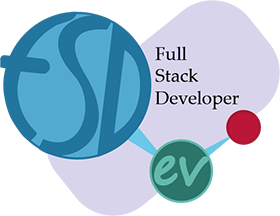

## Командный проект команды FSDev

# HellEN Адский английский

- ### Участники:

  - [Андрей Животовский](https://github.com/AndriiZhyvotovskyi) [linkedin](https://www.linkedin.com/in/andrii-zhyvotovskyi-017b03158/)
  - [Вадим Евланов](https://github.com/Google-Barma) [LinkedIn](https://www.linkedin.com/in/vadym-yevlanov-14b3201a6/)
  - [Виктор Петлюк](https://github.com/chain-mailer) [LinkedIn](https://www.linkedin.com/in/viktor-petliuk/)
  - [Дмитрий Осипов](https://github.com/Dima-Os) [linkedIn](https://www.linkedin.com/in/dmytro-osipov-ba032b177)
  - [Дмитрий Шамота](https://github.com/dmitrij-sh) [facebook](https://www.facebook.com/dmitrij.shamota)
  - [Иван Фесенко](https://github.com/IvanFesenko) [instagram](https://www.instagram.com/did1van/)
  - [Максим Козлов](https://github.com/Maximusvin) [LinkedIn](https://www.linkedin.com/in/maxim-kozlov/)
  - [Никита Самойленко](https://github.com/Bignichok)
  - [Николай Винничук](https://github.com/Mykola-Vynnychuk) [facebook](https://www.facebook.com/mykola.vynnychuk)

### Ссылки:

- [Демо версия на github.io](https://ivanfesenko.github.io/HellEN/)
- [Рабочий продукт](https://hellen.fun/)

#### Проект собирался используя [Gulp Starter Kit](https://github.com/luxplanjay/gulp-starter-kit)
